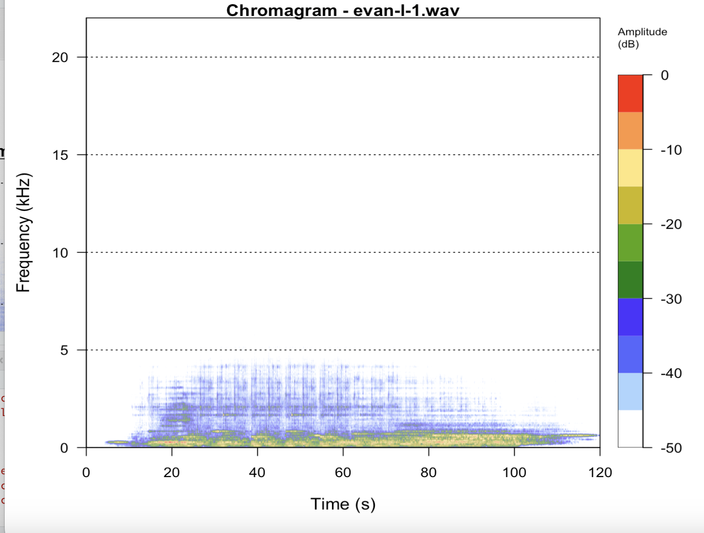
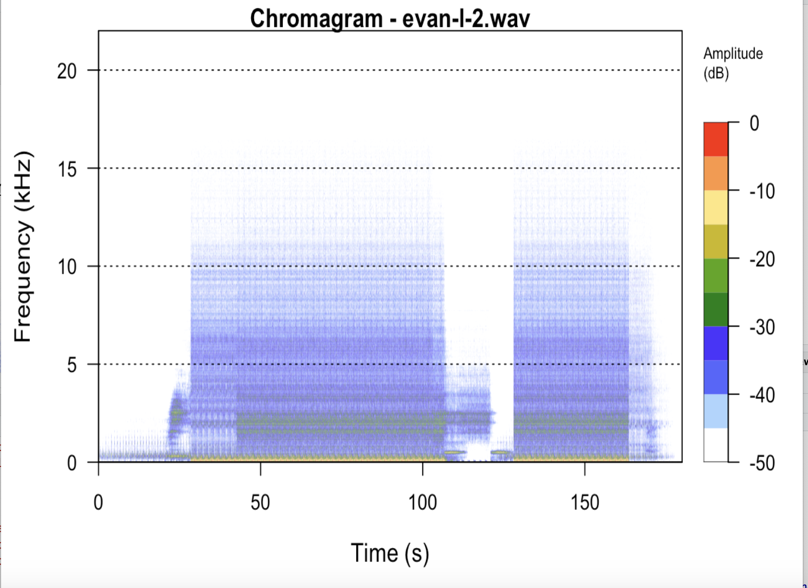
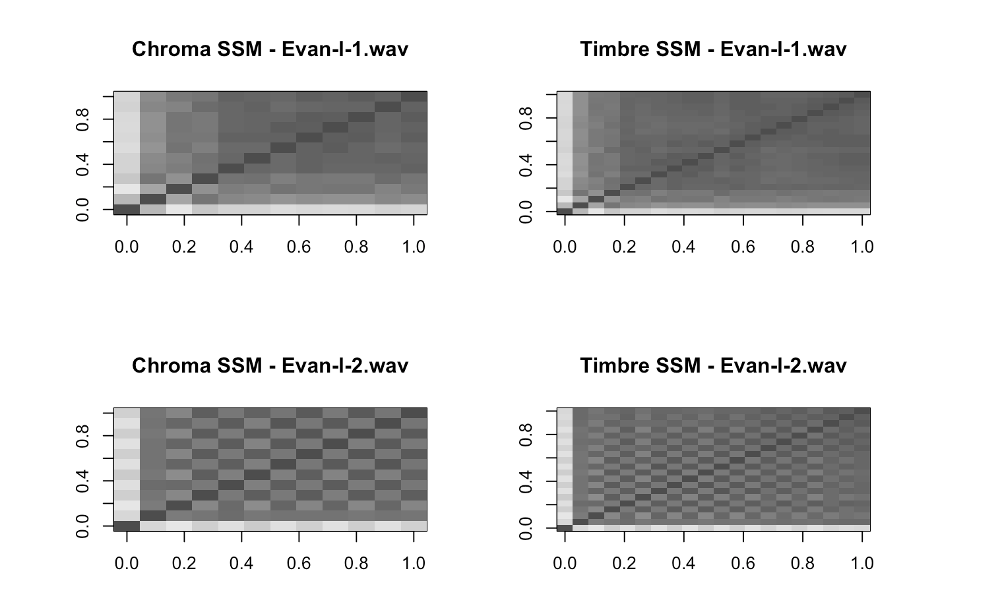

```{r setup, include=FALSE}
knitr::opts_chunk$set(echo = TRUE)
library(ggplot2)
library(flexdashboard)
library(plotly)
library(readr)
library(dplyr)

library(tuneR) # used for the readWave() function
library(seewave) # used for spectro()
library(av) # used for av_audio_convert()

library(tidyverse)
library(tidymodels)
library(ggdendro)
library(heatmaply)

library(viridis) # for color scatterplot

#mp3 to wav conversion -> if statement to prevent console overloading
if (!file.exists("evan-l-1.wav")) {
  av_audio_convert("evan-l-1.mp3", "evan-l-1.wav", format = "wav")
}
if (!file.exists("evan-l-2.wav")) {
  av_audio_convert("evan-l-2.mp3", "evan-l-2.wav", format = "wav")
}


source('compmus.R')

compmus_data <- read_csv("compmus2025.csv")

chord_templates <- tribble(
  ~name, ~template,
  "C", c(1, 0, 0, 0, 1, 0, 0, 1, 0, 0, 0, 0),
  "C#", c(0, 1, 0, 0, 0, 1, 0, 0, 1, 0, 0, 0),
  "D", c(0, 0, 1, 0, 0, 0, 1, 0, 0, 1, 0, 0),
  "D#", c(0, 0, 0, 1, 0, 0, 0, 1, 0, 0, 1, 0),
  "E", c(0, 0, 0, 0, 1, 0, 0, 0, 1, 0, 0, 1),
  "F", c(1, 0, 0, 0, 0, 1, 0, 0, 0, 1, 0, 0),
  "F#", c(0, 1, 0, 0, 0, 0, 1, 0, 0, 0, 1, 0),
  "G", c(0, 0, 1, 0, 0, 0, 0, 1, 0, 0, 0, 1),
  "G#", c(1, 0, 0, 1, 0, 0, 0, 0, 1, 0, 0, 0),
  "A", c(0, 1, 0, 0, 1, 0, 0, 0, 0, 1, 0, 0),
  "A#", c(0, 0, 1, 0, 0, 1, 0, 0, 0, 0, 1, 0),
  "B", c(0, 0, 0, 1, 0, 0, 1, 0, 0, 0, 0, 1)
)

#own tracks
my_tracks <- c("evan-l-1", "evan-l-2")
json_my_tracks <- c("features/evan-l-1.json", "features/evan-l-2.json")
```

# 1. Introduction

### Background & Track Selection

*How do two completely different musical moods take shape in data?* This dashboard presents a comparative analysis of two AI-generated tracks I created using Stableaudio AI. One track explores ambient minimalism, while the other is a high-energy breakbeat.

**Track 1:** *Meditative Ambient Soundscape*\
- Tags: Ambient, Post-Rock, Minimalist, Reverb, 60 BPM

**Track 2:** *Energetic Breakbeat Rave*\
- Tags: Breakbeat, Acid Breaks, Chaotic, 135 BPM

### Learning Goals

As an Information Science student, both the world of computational music analysis and music production were fairly new territories to me at the start of this project. While I was familiar and comfortable with working with data, exploring music through features like tempo, valence, or timbre was entirely new to me. Prior to this project I had only limited knowledge about music theory, although I have always had a casual interest in music at its broadest. As for the computational aspects I did have a bit of RStudio knowledge, though I was used to working with different types of data and visualizations than those explored in this course, so even this was novel for me.

Starting off, I experimented with multiple AI music generators, but many of them felt too rigid or unpredictable. Eventually, I settled on Stableaudio AI for its detailed prompt control and more satisfying sonic results. My goal was to create two starkly contrasting tracks: one calm and ambient, the other chaotic and energetic, so that I could explore the musical and data-level differences more clearly across various analytical features.

If I had more time or production experience, I would have loved to compose or produce my own music from scratch. However, given the time constraints and learning curve using AI allowed me to focus more on the analytical side of this project so that the AI tracks could be used as case studies to compare both with each other and with the class corpus.

Ultimately, my goal during this project was not just the generation of music, but rather to develop a deeper understanding of how music by exploring how differences between two songs become visible through data.

------------------------------------------------------------------------

# 2.1 AI-Generated Tracks

For this project, I generated two original pieces of music using **Stableaudio AI** ([Stableaudio](https://stableaudio.com/generate)). My goal was to create two strongly contrasting tracks—one meditative and slow-paced, the other aggressive and heavier in terms of rhythm. This contrast helped me make more insightful comparisons when analyzing musical features across mood, energy, and structure.

To shape each track, I wrote detailed prompts inspired by genre tags from **RateYourMusic.com**, including emotional and instrumental descriptors.

**Track 1: Meditative Ambient Soundscape**

**Style:** Ambient, Post-Rock, Cinematic\
**Length:** 2 minutes\
**Goal:** A calm, meditative ambient with minimal instrumentation.

**Tags Used:**\
Ambient, Post-Rock, Cinematic, Ethereal, Soothing, Meditative, Minimalist, Warm Subtle Bass, Deep Drones, Airy Pads, Textures, Analog Synths, Field Recordings, Wind Sounds, Reverb, **60 BPM**

**Track 2: Energetic Breakbeat Rave**

**Style:** Breakbeat, Acid Breaks, 90s Rave\
**Length:** 2 minutes\
**Goal:** A high-energy, chaotic breakbeat track.

**Tags Used:**\
Breakbeat, Acid Breaks, 90s Rave, Energetic, Raw, Funky, Chaotic, Breakbeats, Deep Bass, Distorted 808, Acid Bass, Filtered Chords, Reversed Pads, Vocal Chops, **135 BPM**

### Listen to Track 1 (Ambient)

```{r, results='asis', echo=FALSE}
cat('<audio controls>
  <source src="evan-l-1.mp3" type="audio/mpeg">
  Your browser does not support the audio element.
</audio>')
```

### Listen to Track 2 (Breakbeat)

```{r, results='asis', echo=FALSE}
cat('<audio controls>
  <source src="evan-l-2.mp3" type="audio/mpeg">
  Your browser does not support the audio element.
</audio>')
```

------------------------------------------------------------------------

# 2.2 Track Creation

Creating the tracks involved three steps:

1.  **Prompt Design:**\
    I began by exploring genre tags on RateYourMusic, collecting descriptors that captured the mood, instrumentation, and texture I wanted. I made sure to include detailed keywords around tempo, style, and sound design to give Stableaudio clear guidance.

2.  **Generation:**\
    I then entered these prompts into Stableaudio AI to generate multiple versions of each track. It took some trial and error to get the sonic qualities I envisioned, especially for the ambient piece, where subtle dynamic and layered space were essential.

3.  **Finalization:**\
    Once I had promising outputs, I evaluated them critically and overall judged the quality of several of my prompt outcomes. I selected the strongest versions, exported them as MP3s, and prepared them for analysis in this dashboard.

With both tracks finalized the next step was to dive into the data, starting with an exploration of its features.

------------------------------------------------------------------------

# 3. Scatterplot

### Scatterplot - Danceability vs. Tempo

To begin my analysis, I wanted a straightforward visualisation that would let me place my own tracks within the context of the class corpus. I chose a scatterplot because it clearly separates each data point, which helped me to quickly identify how my tracks compare in terms of danceability and tempo, as these two features often shape the overall feel of a track.

This interactive scatterplot maps Danceability against Tempo of the tracks, which helps to position my two AI-generated tracks within the entire class corpus.


**NOTE** Interestingly enough, this scatterplot has changed quite a bit from the first time I had generated it: before this, my ambient track (red) was positioned as both slow and undanceable, while the breakbeat track was slightly higher in both tempo and danceability. For some reason I cannot figure out, this changed sometime during the last few weeks. Perhaps there was an adjustment to the class corpus features, and it impacted the estimated tempo of those two tracks. It now states that my ambient tracks sits at over 150 BPM, while I generated it to be much lower than that, and certainly not faster than the breakbeat track. So, my analysis below still reflects this interpretation, as this was actually rooted in reality.


There appears to be no set correlation between the danceability and tempo of the tracks. However, an interesting pattern emerges: there are two clusters, one with low danceability, and another with high danceability, while the tempo does not differ much.

Regarding my own tracks:

-   The **calm ambient track** has an average tempo and low danceability.
-   The **breakbeat song** has an average tempo but high danceability.

One particularly surprising observation is how the AI interpreted the second song’s tempo. While I set it to **135 BPM**, it was classified as **93 BPM**. This suggests that the AI might have emphasized a different rhythmic structure or half-time feel in its classification.

**EDIT** As stated above, here is another case of the estimated tempo shifting, but this time for the breakbeat track. Thus, tempo does not appear to be a very consistently evaluated variable. Perhaps each method counts their notes differently.

Overall, the plot allowed me to see individual track positions and emerging clusters. As visible here, there’s a group of tracks with low danceability and another with high danceability, while tempo remains relatively consistent across both clusters. This helped me gain more perspective into where my own tracks 'live' compared to the others, which created a solid mental foundation for further explorations.


```{r danceability_plot, echo=FALSE, fig.width=6, fig.height=4}
dance_plot <- ggplot(compmus_data, aes(x = danceability, y = tempo, color = danceability, text = filename)) +
  geom_jitter(width = 0.01, height = 0.01, size = 2, alpha = 0.6) +
  geom_rug(sides = "bl", alpha = 0.05)  +  
  geom_point(data = compmus_data %>% filter(filename == "evan-l-1"), 
             aes(x = danceability, y = tempo, text = filename), color = "red", size = 3, shape = 17) +
  geom_point(data = compmus_data %>% filter(filename == "evan-l-2"), 
             aes(x = danceability, y = tempo, text = filename), color = "blue", size = 3, shape = 17) +
  scale_color_viridis_c(option = "C") +
  labs(
    title = "Danceability vs. Tempo(BPM)",
    subtitle = "Track 1 (ambient, red) vs. Track 2 (breakbeat, blue)",
    x = "Danceability",
    y = "Tempo",
    color = "Danceability") +
  
  theme_minimal()

# Adjust plot size + hover tooltips show song titles
ggplotly(dance_plot, tooltip = "text")
```


------------------------------------------------------------------------

# 4.1 Chromagrams

### Chromagrams for Class Corpus & Own Tracks

Before diving into the analysis, it's helpful to briefly explain what a chromagram is. A chromagram is a visual representation of harmonic content in music. It maps audio to the 12 pitch classes (C, C#, D, ..., B), showing how energy is distributed across pitches over time, regardless of octave. This is especially useful when analyzing chord progressions, tonality, or harmonic density.

### 1. Technical Issues

Creating these chromagrams proved to be a bit of a journey for me. I initially struggled because I missed the session where we were introduced to the compmus.R helper file. As I did not know it existed, I tried calculating chromagrams (and later, self-similarity matrices) using external packages like tuneR and seewave.

Eventually, I did manage to get my plots working, though it took a lot of trial and error. Even after discovering the compmus.R file, I ran into some persistent bugs, possibly due to updates to the helper functions or conflicts in how I had structured my analysis. For now, I’ve kept my original chromagram approach intact, since it renders reliably in R.

One thing I did notice was how the resulting spectrograms could benefit from better log-frequency mapping. Without it, the lower frequencies, especially in my ambient track, appear faint or almost non-existent. This is a fair reflection though, as the track is meant to be minimal and quiet.

### 2. Initial Attempt (Failed)

Below are screenshots from my first attempt at generating chromagrams using waveform-based spectrograms via `tuneR` and `seewave`.\
While they visually resembled spectrograms, they did not accurately reflect pitch-class content and failed to render properly within the RMarkdown dashboard.

```{r chromagrams, echo=FALSE}
#currently has issues loading.. why?

#change up the compmus file + add from tutorial

plot_chromagram <- function(file) {
  wave <- readWave(file)
  dev.new()  # To open a new graphic
  spectro(wave, wl = 1024, ovlp = 75, collevels = seq(-50, 0, 5), main = paste("Chromagram -", file))
}

par(mfrow = c(2,1))
plot_chromagram("evan-l-1.wav")
plot_chromagram("evan-l-2.wav")
```

 

### 3. Chromagram 1.0 Results

**Track 1 — Ambient**

Energy is concentrated in the lower frequency range (below \~5 kHz)\
The overall amplitude is low, reflecting the sparse, ambient atmosphere\
The structure is fluid and minimal, with little rhythmic emphasis

**Track 2 — Breakbeat**

Frequency content spans a much wider range, reaching above 10 kHz\
Brighter colors indicate greater amplitude and more harmonic variation\
Suggests a more rhythmic, melodic, and dynamic structure, consistent with breakbeat styles

So, although the chromagram for the ambient track appears faint and minimal, this is true to the source material which was designed to be slow, textured, and atmospheric. In contrast, the breakbeat track is vibrant and information-dense, with sharper contrasts and more visible harmonic shifts.

---

# 4.2 Updated Chromagrams

I later discovered the `compmus.R` helper file includes a purpose-built `compmus_chroma` function, so I calculated them again in the correct way.

```{r chromagrams_ab, echo=FALSE, fig.width=6, fig.height=4}
# Chromagram for Ambient Track
"features/evan-l-1.json" |> 
  compmus_chroma(norm = "identity") |>
  ggplot(aes(x = time, y = pc, fill = value)) +
  geom_raster() +
  scale_y_continuous(
    breaks = 0:11,
    labels = c("C", "C#|Db", "D", "D#|Eb", "E", "F", "F#|Gb", "G", "G#|Ab", "A", "A#|Bb", "B")
  ) +
  scale_fill_viridis_c(guide = "none") +
  labs(title = "Chromagram – Evan-l-1 (Ambient)", x = "Time (s)", y = NULL) +
  theme_classic()
```

```{r chromagrams_bb, echo=FALSE, fig.width=6, fig.height=4}
# Chromagram for Breakbeat Track
"features/evan-l-2.json" |> 
  compmus_chroma(norm = "identity") |>
  ggplot(aes(x = time, y = pc, fill = value)) +
  geom_raster() +
  scale_y_continuous(
    breaks = 0:11,
    labels = c("C", "C#|Db", "D", "D#|Eb", "E", "F", "F#|Gb", "G", "G#|Ab", "A", "A#|Bb", "B")
  ) +
  scale_fill_viridis_c(guide = "none") +
  labs(title = "Chromagram – Evan-l-2 (Breakbeat)", x = "Time (s)", y = NULL) +
  theme_classic()
```

### 4. Chromagram 2.0 Results


**Track 1 — Evan-l-1.wav (Ambient):**

There is a clear strong harmonic emphasis on F#, D#, and C#, with F# especially dominant.F# remains smoothly present and stable throughout most of the likely making it the tonic, thus track 1 can be described as a tonally consistent piece with little modulation. This aligns with the overall genre conventions of ambient tracks, where strong tonal consistenty with slow shifts play an important role in creating the wanted atmosphere.


**Track 2 — Evan-l-2.wav (Breakbeat):**

The harmonic content appears much more scattered over multiple pitch classes, with some light bursts of color in D, D#, and G. The texture appears relatively unstable, which aligns with the more complex and evolving harmonic structure the song has. This also reflects the genre conventions of breakbeat, which usually have rapid tonal shifts.

Conclusively, these two chromagrams helped me further confirm the contrast I was aiming for: one track being repetitive and stable, while the other is chaotic and rhythmically all over the place.
------------------------------------------------------------------------

# 5. Self-Similarity Matrices

After exploring harmonic content through chromagrams, I turned to self-similarity matrices (SSMs) to better understand the internal structure of my two tracks.

SSMs compare every moment in a song with every other moment, based on chosen features like chroma or timbre. This creates a square matrix where repeated or similar sections appear as distinct patterns—such as diagonal lines (repetitions), blocks (sections), or checkerboards (alternating segments). They're very useful for spotting structural repetition, dynamic contrast, and transitions that might not be immediately audible.

---

### SSM Visuals

Within the context of my musical exploration these SSMs helped me explore how much variety or repetition exists in my tracks—and whether those patterns aligned with what I intended in the composition prompts. As with the chromagrams, I initially used external packages to generate my self-similarity matrices (tuneR, seewave, and melfcc() from phonTools). Luckily, the output remains very clear and useful, even if slightly stylistically different from the class standard.

```{r self_similarity, echo=FALSE, fig.width=6, fig.height=6}
compute_ssm <- function(file, feature = "chroma") {
  wave <- readWave(file)
  if (feature == "chroma") {
    chroma <- melfcc(wave, numcep = 12)
    dist_matrix <- as.matrix(dist(t(chroma)))
  } else if (feature == "timbre") {
    timbre <- melfcc(wave, numcep = 20)
    dist_matrix <- as.matrix(dist(t(timbre)))
  }
  return(dist_matrix)
}

# Compute SSMs once
ssm_chroma_1 <- compute_ssm("evan-l-1.wav", "chroma")
ssm_timbre_1 <- compute_ssm("evan-l-1.wav", "timbre")
ssm_chroma_2 <- compute_ssm("evan-l-2.wav", "chroma")
ssm_timbre_2 <- compute_ssm("evan-l-2.wav", "timbre")
```

---

### SSMs

---

### SSM Interpretation

-   **Evan-l-1.wav - Ambient**
    -   The chroma SSM is fairly uniform, with only mild internal variation. This fits the track’s ambient purpose: minimal harmonic shifts and slow movement.
    -   The timbre SSM is smooth and almost static, reflecting the consistent use of textures and sparse instrumentation.
-   **Evan-l-2.wav - Breakbeat**
    -   The chroma SSM features a checkerboard-like structure, which suggests the presence alternating harmonic material or call-and-response phrasing.This is apparently typical of fast-paced breakbeat.
    -   The timbre SSM shows greater diversity and shifting textures, likely due to drum fills, chopped vocal samples, and synthesized layers that I requested in my prompt.

Despite being AI-generated, both tracks exhibit recognizable structural patterns that align with their intended genres. The ambient track relies on repetition and slow shifts, while the breakbeat track emphasizes variety and rhythmic segmentation. These SSMs were one of the clearest visual confirmations of that difference.

------------------------------------------------------------------------

# 6. Keygram

Chordograms/Keygrams offer a great way to visualize how harmonic templates such as keys align with the audio over time. They are derived from chroma features, but rather than showing raw pitch-class energy, they show how closely the signal matches known musical templates like major/minor chords.

For this step, I finally managed to use the class’s compmus.R functions after struggling initially with the wrong feature format. Now that I had access to my .json chroma features, I could apply the pitch matching function. I wanted to generate keygrams to better understand the tonal content of each track. Since both songs belong to abstract or electronic genres (ambient and breakbeat), it wasn’t obvious what key either was in just by listening. So, a visualisation of harmonic similarity across key templates offered an analytical alternative.

I used the 'viridis' colour scale, in which **darker colours imply a stronger presence, while lighter colours indicate absence.**
---
### Track 1: Ambient

```{r chordogram_ambient, echo=FALSE}
# Chordogram for Track 1
chordogram_1 <- 
  "features/evan-l-1.json" |> 
  compmus_chroma(norm = "identity") |> 
  compmus_match_pitch_templates(
    chord_templates,
    norm = "identity",
    distance = "cosine"
  ) |> 
  ggplot(aes(x = time, y = name, fill = d)) + 
  geom_raster() +
  scale_fill_viridis_c(guide = "none") +
  labs(title = "Chordogram – Evan-l-1 (Ambient)", x = "Time (s)", y = "Chord") +
  theme_classic()

chordogram_1
```

### Keygram Interpretation - Track 1
    -   The ambient piece exhibits extensive key ambiguity—most pitch classes (keys) are present to some degree.
    -   The F♯ key shows a strong, consistent presence throughout the entire track, so it might serve as a tonal center.
    -   Notably, B and A♯ are nearly absent, as are G/E/C which could imply intentional exclusion or simply a lack of harmonic content in those registers
    -   The blurred, smooth transitions between chords match what one might expect from an ambient texture—low harmonic rhythm, lots of overlap, and little definitive resolution.
    
---
    
### Track 2: Breakbeat    
    
```{r chordogram_breakbeat, echo=FALSE}    
# Chordogram for Track 2
chordogram_2 <- 
  "features/evan-l-2.json" |> 
  compmus_chroma(norm = "identity") |> 
  compmus_match_pitch_templates(
    chord_templates,
    norm = "identity",
    distance = "cosine"
  ) |> 
  ggplot(aes(x = time, y = name, fill = d)) + 
  geom_raster() +
  scale_fill_viridis_c(guide = "none") +
  labs(title = "Chordogram – Evan-l-2 (Breakbeat)", x = "Time (s)", y = "Chord") +
  theme_classic()

chordogram_2
```

### Keygram Interpretation - Track 2
    -   The breakbeat track is far more rhythmically and harmonically active than the ambient track, as its keygram is much more dynamic
    -   Most striking is the clear modulation or key shift around 30 seconds in—D♯ and E gain dominance, where earlier they were barely present. This aligns with a mid-track 'build-up' or drop, common in breakbeat and rave genres.
    -   The activity is highly dynamic and colorful, which reflects the energetic and intense piece of music.
    -   Compared to the ambient track, this piece cycles through multiple harmonic centers, yet doesn’t dwell on any one key for long.

Conclusively, the ambient track displays strong harmonic minimalism, while the breakbeat track displays harmonic variability. It is interesting how both of these reflect their respective genre conventions, and how it would be easy to tell which track is which from the keygrams alone.

------------------------------------------------------------------------

# 7.1 Tempo Analysis

### Tempo Histogram for Class Corpus

Before analyzing my own tracks' tempo structures in detail, I first wanted to understand how tempo is distributed across the entire class corpus. My goal was to see where my own AI-generated tracks might fit within the broader spectrum of musical pacing in the dataset.

To do this I chose to visualize the tempo of each track using a histogram. A bar plot is one of the most straightforward ways to represent frequency distributions, and in this context, it clearly displays which tempos are most common in the class corpus. I also used Plotly to make the plot interactive, so individual tempo bins can be hovered over to reveal exact values.

```{r tempo_analysis, echo=FALSE, fig.width=6, fig.height=4}
# Histogram of tempo for the class corpus
plotly::ggplotly(
compmus_data %>%
  ggplot(aes(x = tempo)) +
  geom_histogram(binwidth = 5, fill = "blue", color = "black") +
  theme_minimal() +
  labs(title = "Histogram of Tempo - Class", x = "Tempo (BPM)", y = "Count")
)
```

From the histogram, we can see that the most frequent tempo (mode) in the class corpus is 85 BPM, with a count of 16 tracks. This relatively slow pace is commonly associated with genres like hip-hop, downtempo electronic, or ballads—genres that often center around groove or mood rather than rapid movement. It also aligns roughly with the human resting heart rate, which may contribute to its perceived 'naturalness'.

The tempo distribution also shows smaller peaks in higher ranges, this could hint at clusters of tracks with faster or more danceable tempos like those found in house, pop, or techno.

---

# 7.2 Tempograms - My Tracks

## Tempogram – Track 1 (Ambient)

After establishing the previous benchmark, I visualized the tempograms of my two AI-generated songs. These tempograms are generated from the JSON feature files and show how rhythmic intensity evolves over the duration of each track.

```{r tempogram_ambient, echo=FALSE,  fig.width=6, fig.height=4}
# Generate tempograms for user contributions
ambient_tempogram <- compmus_tempogram("features/evan-l-1.json", window_size = 8, hop_size = 1, cyclic = FALSE)
ggplot(ambient_tempogram, aes(x = time, y = bpm, fill = power)) +
  geom_raster() +
  scale_fill_viridis_c(guide = "none") +
  labs(title = "Tempogram – Evan-l-1 (Ambient)", x = "Time (s)", y = "Tempo (BPM)") +
  theme_classic()
```

## Tempogram – Track 2 (Breakbeat)

```{r tempogram_breakbeat, echo=FALSE,  fig.width=6, fig.height=4}
# Generate tempograms for user contributions
breakbeat_tempogram <- compmus_tempogram("features/evan-l-2.json", window_size = 8, hop_size = 1, cyclic = FALSE)
ggplot(breakbeat_tempogram, aes(x = time, y = bpm, fill = power)) +
  geom_raster() +
  scale_fill_viridis_c(guide = "none") +
  labs(title = "Tempogram – Evan-l-2 (Breakbeat)", x = "Time (s)", y = "Tempo (BPM)") +
  theme_classic()
```

## Tempogram – Track 2 (Breakbeat)

-   **Track 1 - Ambient**
    -   The tempogram is fairly uniform and flat for the first half. This is consistent with how smooth and uniform the track is.
    -   Around the 60-second mark, the regularity begins to break down, and we observe some fragmentation and drift in the tempo bands. This showcases the more layered elements that are audible in this track, such as the addition of audio tape samples.
    
    
-   **Track 2 - Breakbeat**
    -   This track displays clearly defined, horizontal tempo bands, which indicates a steady and repetitive beat.
    -   The multiple stacked lines reflect regular subdivisions (ex: half-time, double-time) which are typical in breakbeat and rave music.
    -   The activity is highly dynamic and colorful, which reflects the energetic and intense piece of music.
    -   There’s a minor disturbance just past the halfway point—likely a bridge or breakdown before returning to the core rhythmic pattern.

Comparing these tempograms visually strengthens the contrast in structure between my two tracks. The ambient piece is loosely timed, smooth, and much more textural, while the breakbeat track is rigid, fast-paced, and driven by its beat. This rhythmic contrast further supports what was established in earlier keygrams and SSMs, as each track is clearly distinct in both feel and temporal organization.

------------------------------------------------------------------------

# 8.1 Full Feature Dendrogram

To finalize my feature exploration I wanted to visualize how different tracks group together based on their musical characteristics. Dendrograms, which visualize hierarchical clustering, are perfect for this kind of exploratory analysis: They show the relative similarity between tracks and form clusters where songs with similar musical features are grouped closer together.


I began by creating a dendrogram based on five track-level features: **valence, arousal, danceability, tempo, and instrumentalness**. This was mainly exploratory to give me a sense of how different the tracks in our class corpus really are when analyzed together. This general dendrogram already shows some distinct clustering patterns, although it's based on a broader set of features.

## Dendrogram Plot

```{r clustering_dendrogram, echo=FALSE, fig.width=7, fig.height=4, fig.align='center'}

# Prepping the data
cluster_juice <-
  recipe(
    filename ~ arousal + danceability + instrumentalness + tempo + valence,
    data = compmus_data
  ) |>
  step_center(all_predictors()) |>
  step_scale(all_predictors()) |> 
  prep(compmus_data) |>
  juice() |>
  column_to_rownames("filename")

compmus_dist <- dist(cluster_juice, method = "euclidean")

# Dendrogram Plot
compmus_dist |> 
  hclust(method = "average") |> 
  dendro_data() |>
  ggdendrogram() +
  labs(title = "Dendrogram of Class Corpus", y = "Distance") +
  theme_minimal()
```


---

# 8.2 Mood-Based Dendrogram

Since my two AI-generated tracks are drastically different in energy and mood, I wanted to focus more directly on clustering the corpus based on the emotional and rhythmic character of each song. For this, I narrowed it down to just **valence, arousal and tempo**.

## Mood-Based Dendrogram Plot

```{r clustering_mood_only, echo=FALSE, fig.width=7, fig.height=4, fig.align='center'}
mood_cluster <-
  recipe(
    filename ~ valence + arousal + tempo,
    data = compmus_data
  ) |>
  step_center(all_predictors()) |>
  step_scale(all_predictors()) |> 
  prep(compmus_data) |>
  juice() |>
  column_to_rownames("filename")

mood_dist <- dist(mood_cluster, method = "euclidean")
mood_hclust <- hclust(mood_dist, method = "average")

# Plot alternative dendrogram based on mood features only
ggdendrogram(mood_hclust, rotate = FALSE, theme_dendro = FALSE) +
  labs(
    title = "Dendrogram of Chill vs. Energetic Music",
    subtitle = "Valence + Arousal + Tempo",
    x = "Tracks",
    y = "Distance"
  ) +
  theme_minimal() +
  theme(
    axis.text.x = element_text(angle = 90, vjust = 0.5, hjust = 1),
    axis.ticks.x = element_blank()
  )
```


In this mood-based dendrogram, tracks that cluster lower tend to be more similar in emotional character. In this case, that often means relaxed, calm, or lo-fi — including my ambient track. My breakbeat track, on the other hand, clusters higher up, which indicates that it’s more distinct and intense in mood and energy.

To conclude, this dendrograms pattern aligns reasonably well with my own two tracks. My ambient piece is grouped low in the dendrogram, nestled among similarly relaxed tracks. Meanwhile, the breakbeat track is positioned much higher, reflecting its chaotic energy and rhythmic aggression. Seeing this contrast play out in the structure of the dendrogram was especially satisfying as it served as a visualization for something that is often only describable as a 'vibe' or 'energy', now being measurably present in the data.

------------------------------------------------------------------------

# 9. Final Thoughts

### Feature Summary Table

```{r feature-table, echo=FALSE}
library(knitr)
track_features <- tribble(
  ~Feature, ~"Ambient Track", ~"Breakbeat Track",
  "Tempo", "60 BPM", "135 BPM (detected as ~93 BPM)",
  "Danceability", "Low", "High",
  "Energy", "Low", "High",
  "Valence", "Neutral", "Moderate",
  "Key Stability", "Very stable (F#)", "Shifting (D#/E)",
  "Structure", "Minimal, ambient", "Chaotic, rhythmic"
)

kable(track_features, caption = "Feature Summary: Ambient vs. Breakbeat")
```

### Reflections on the Process

Coming into this project without a strong background in either computational analysis or musicology, I wasn’t entirely sure what to expect. My experience with R was minimal and limited to a single data science course two years ago, and my musical understanding was more intuitive than technical. But working through this analysis gave me a surprisingly rich perspective on how musical qualities manifest in data.

What stood out to me the most was seeing the contrast between my two AI-generated tracks unfold across each visualization. Because the tracks were intentionally so different (one ambient and meditative, the other energetic and chaotic) the distinctions were clear, which made it much easier to understand what each method was actually showing.

Whether looking at chromagrams, self-similarity matrices, or keygrams, I could begin to interpret the visuals in a way that matched what I had heard intuitively. Even moments like sensing a key shift without knowing the actual notes, only to see that shift appear in the analysis, helped recontextualize how I listen to music altogether. It felt like learning a new language which allowed me to describe and understand music in ways I couldn’t before.

### Takeaways for Future CompMus Beginners

This kind of process could be especially valuable for beginners in musicological analysis, particularly those exploring electronic instrumental music. The contrast between tracks, when made visual, becomes a powerful learning tool. Starting with minimal R knowledge, I found that the code gradually became more intuitive. Flexdashboard, ggplot2, and the compmus helper functions were all far more accessible than I expected once I got into the rhythm of things. My own analysis could serve as a way to better understand these features for other 'compmus beginners' as well. Being able to see harmony, rhythm, structure, and energy not only supports deeper listening, but also helps bridge the gap between abstract sound and analytical clarity.
